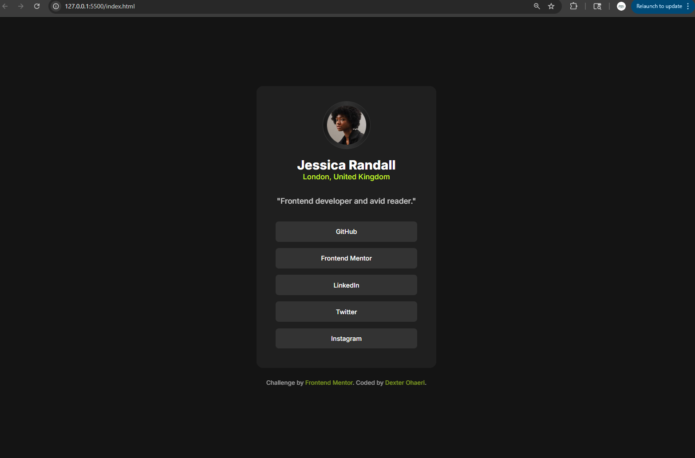
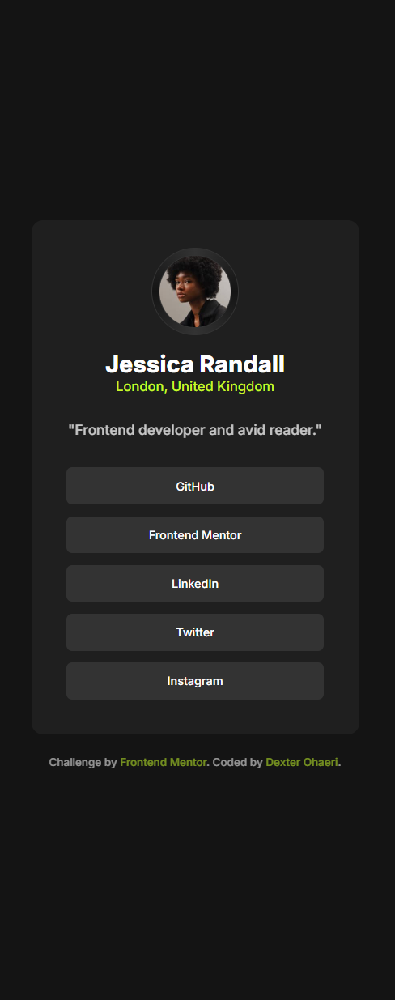
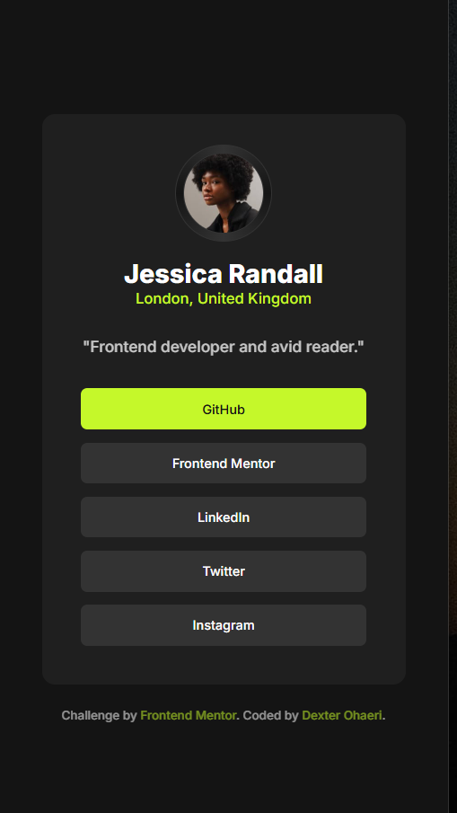

# Frontend Mentor - Social links profile solution

This is a solution to the [Social links profile challenge on Frontend Mentor](https://www.frontendmentor.io/challenges/social-links-profile-UG32l9m6dQ). Frontend Mentor challenges help you improve your coding skills by building realistic projects. 

## Table of contents

- [Overview](#overview)
  - [The challenge](#the-challenge)
  - [Screenshot](#screenshot)
  - [Links](#links)
- [My process](#my-process)
  - [Built with](#built-with)
  - [What I learned](#what-i-learned)
  - [Continued development](#continued-development)
- [Author](#DexterOhaeri)

## Overview

### The challenge

Users should be able to:

- See hover and focus states for all interactive elements on the page

### Screenshot

  

### Links

- Solution URL: [Add solution URL here](https://your-solution-url.com)
- Live Site URL: [Add live site URL here](https://your-live-site-url.com)

## My process

### Built with

- Semantic HTML5 markup
- CSS3
- CSS custom properties
- Flexbox
- CSS Grid

### What I learned

It was a lot easier for me. Just an issue with `padding` for the `<a>` which I quickly resolved by using `display:inline-block` because I have encountered that problem before.

### Continued development

I will keep working to improve my use of custom properties.

## Author

- Frontend Mentor - [@MrDexterO](https://www.frontendmentor.io/profile/MrDexterO)
- GitHub - [@MrDexterO](https://github.com/MrDexterO)

## Acknowledgments

I acknowledge Frontend mentor for this opportunity.
